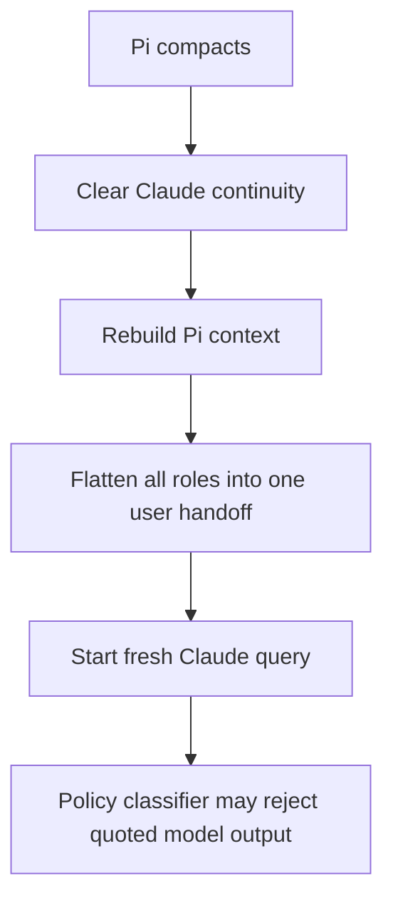
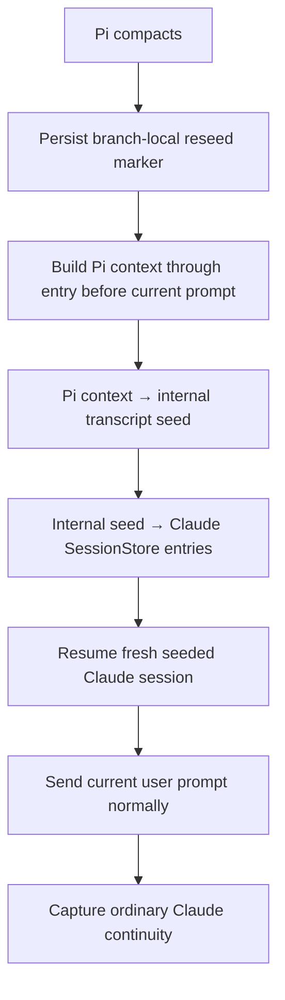

# Design Discussion: Native Claude Transcript Reseeding After Pi Compaction

## Summary of Change Request

Keep Pi's compaction pipeline and structured summaries, but stop flattening the resulting Pi context into one synthetic Claude user message. After Pi compacts, translate Pi's rebuilt context into a fresh Claude Code transcript with native user, assistant, tool-use, and tool-result roles, pre-seed that transcript through the Claude Agent SDK `SessionStore` seam, then resume it and send the current prompt normally.

This is an experiment against a concrete failure: Fable 5 rejects the current post-compaction handoff as apparent model-output duplication even after its framing was neutralized. The design must be easy to remove if the pinned Claude runtime does not accept generated transcripts reliably.

## Review Status

- **Status:** Accepted 2026-07-10
- **Accepted decisions:** Use a private Pi-owned durable store; do not automatically fall back to flattened or lossy context; require completed tool-pair support before production use; initially limit reseeding to Pi compaction.
- **Next artifact:** Structure outline

## What Better Means

- Pi remains the source of truth for compaction boundaries, summary quality, kept-recent context, tree branches, and cross-provider session history.
- The first Fable request after Pi compaction sees the same logical roles Pi sends to ordinary providers instead of quoted assistant output inside a user message.
- A compacted session can continue after query closure, Pi restart, model switching away and back, and tree navigation without reconstructing the flattened handoff.
- Native tool history preserves tool-use IDs, matching results, errors, and ordering when that support is enabled.
- Normal live and resumable Claude continuity remains unchanged.
- Failed seed creation or resume is explicit and retryable; it must not silently drop recent context or fall back to the policy-triggering flattened form.
- An SDK/CLI upgrade that changes the private transcript format is caught by an integration gate before the extension relies on it.

A regression is any design that weakens Pi's compaction, silently loses retained recent messages, writes generated sessions into the user's ordinary Claude project store, or makes normal non-compaction turns depend on reseeding.

## Standards / Design Pressure

The primary pressure is boundary translation from `coding-standards/references/boundaries.md`: Pi messages and Claude transcript entries are dependency-native types on opposite sides of a real provider/runtime seam. The adapter should map Pi context into a small internal seed model and then into Claude's opaque storage shape; Claude JSONL fields must not leak through session control logic.

The lifecycle pressure is `coding-standards/references/state.md`: current null continuity cannot distinguish a genuinely new session from a post-compaction session that must be reseeded. The startup states and transitions need to be explicit so reload, retry, tree navigation, and query closure cannot accidentally choose the wrong path.

Verification follows `coding-standards/references/verification.md`: mocked query options cannot prove that Claude Code accepts a generated transcript. The decisive claim requires a real, opt-in resume test against the pinned SDK and bundled CLI.

## Reconnaissance Summary

- Pi compaction itself is already preserved. `extensions/custom-provider-claude-agent-sdk/compaction.ts:56-91` calls Pi's exported `compact()` with the complete preparation, including previous-summary and split-turn handling.
- `session_compact` currently calls `resetSessionForStructuralChange()` (`extensions/custom-provider-claude-agent-sdk/index.ts:48-52`), which clears the SDK session ID and makes the next turn cold (`extensions/custom-provider-claude-agent-sdk/session.ts:401-424`).
- Cold startup calls `buildPiSessionHandoff()` and turns rebuilt Pi roles into prose (`extensions/custom-provider-claude-agent-sdk/session.ts:449-501`, `handoff.ts:60-121`). Assistant messages become `Response:` text; tool IDs and native roles are discarded.
- `runSessionQuery()` adds that prose as a non-querying user message before the real prompt (`extensions/custom-provider-claude-agent-sdk/sdk/query.ts:376-439`). A separate trailing-tool-result recovery path builds the same kind of flattened continuation (`sdk/query.ts:289-312`).
- The installed `@anthropic-ai/claude-agent-sdk` is pinned at 0.2.141 with bundled Claude Code 2.1.141. Its `SessionStore.load()` materializes entries into a temporary Claude project transcript before subprocess spawn (`node_modules/.bun/@anthropic-ai+claude-agent-sdk@0.2.141+27912429049419a2/node_modules/@anthropic-ai/claude-agent-sdk/sdk.d.ts:3782-3885`).
- `query()` supports `resume` plus `sessionStore`; `sessionId` must not also be supplied unless forking (`sdk.d.ts:1560-1574`).
- The concrete `SessionStoreEntry` union is explicitly CLI-internal. The public contract guarantees only a string `type`, optional UUID/timestamp, and opaque JSON fields (`sdk.d.ts:3874-3890`).
- Real local transcripts show a linear `parentUuid` chain. Assistant `tool_use` blocks are followed by top-level user entries containing matching `tool_result` blocks; there is no top-level tool role. Real compacted Claude sessions also use coordinated private boundary metadata, so the extension should not fabricate Claude compact-boundary entries.
- `InMemorySessionStore` is intended for testing and loses data at process exit (`sdk.d.ts:825-849`). Because the SDK materializes resumed store entries into a temporary config and cleans it up, production continuity needs a durable store if query closure or process restart must work.

## Current State



Normal turns are better behaved: a live query continues through the input queue, and a closed query resumes the persisted Claude session ID. Only structural resets and stale recovery rebuild from Pi.

The first framing-only experiment changed handoff labels and removed transcript/imitate wording. The same Fable policy refusal remained, which makes role flattening—not the summary prose alone—the leading hypothesis.

## Desired End State



Normal live/resumable turns bypass all reseed work.

The seed is ordinary linear history, not a fabricated Claude compaction event. Pi's compaction summary is represented as the same synthetic user-context message Pi normally creates, followed by retained native-role messages. The current prompt is excluded from the seed and is the first querying input.

## What We're Not Doing

- Replacing Pi compaction with Claude Code auto-compaction.
- Changing Pi's compaction prompt, summary format, cut points, kept-recent budget, or summarizer selection.
- Writing generated transcripts directly into `~/.claude/projects`.
- Fabricating Claude `compact_boundary`, `compactMetadata`, `isCompactSummary`, or preserved-message metadata.
- Synthesizing thinking blocks or thinking signatures.
- Supporting multiple SDK/CLI transcript versions speculatively.
- Preserving the flattened handoff as an automatic compatibility fallback after the native path ships.
- Changing normal live/resume behavior when Claude continuity is valid.

## Proposed End State Architecture

### 1. Explicit startup state

Replace the current implicit combination of nullable continuity plus `skipHandoff` with an explicit startup decision:

```ts
type ClaudeTurnStartup =
  | { kind: "continue" }
  | { kind: "cold"; handoff?: string }
  | { kind: "reseed"; sourceLeafId: string | null; reason: "pi-compaction" | "stale-context" };
```

A branch-local persisted marker must distinguish `reseed` from an ordinary new/forked cold session. Successful SDK session capture transitions reseed state into ordinary resumable continuity. Failed startup leaves it retryable.

### 2. A deep transcript adapter

Add one boundary module responsible for the private format:

```text
Pi AgentMessage[]
  → ClaudeTranscriptSeed
  → SessionStoreEntry[]
```

The internal seed model should express only stable meaning:

```ts
type ClaudeTranscriptSeed = {
  sessionId: string;
  entries: Array<
    | { kind: "user"; content: PromptBlock[] }
    | { kind: "assistant"; model?: string; content: SeedAssistantBlock[]; stopReason: "end_turn" | "tool_use" }
    | { kind: "tool-results"; results: SeedToolResult[] }
  >;
};
```

The Claude JSONL encoder owns UUID generation, parent chaining, timestamps, session/cwd/version fields, assistant envelopes, usage placeholders, and MCP tool-name mapping. Query/session control code receives a completed seed and does not know JSONL fields.

### 3. A private durable `SessionStore`

Use a Pi-owned file-backed store under the Pi agent directory, scoped by Pi session and Claude seed session ID. It should:

- append JSON-safe entries in order;
- deduplicate UUID-bearing entries;
- atomically persist append batches;
- load a complete transcript for explicit resume;
- serialize access per session;
- delete only sessions owned by this extension;
- avoid implementing optional listing/subagent methods until a caller needs them.

The exact path is an implementation detail of the store. It must not share `~/.claude/projects`, and it must not be persisted inside Pi's session JSONL because transcripts can be large.

### 4. Query startup

For `reseed`, call Claude's `query()` with:

```ts
{
  resume: seed.sessionId,
  sessionStore: durableStore,
}
```

Do not pass `sessionId`, and do not enqueue a `shouldQuery:false` handoff. The current prompt remains the sole querying queue message. Subsequent query closures resume the captured ID through the same store.

### 5. Two staged probes

Because the transcript format is private, do not implement the full converter before proving the seam.

**Probe A: text roles**

Seed Pi's compaction summary plus retained text-only user and assistant entries. Run a real opt-in SDK integration test that asks the model to identify a harmless fact available only in seeded assistant history. This proves materialization, role preservation, response, mirroring, close, and second resume.

**Probe B: tool history**

Add one completed assistant `tool_use` plus user `tool_result` pair with matching IDs and verify a new prompt can continue without replaying the historical tool. Only after this passes should production conversion support tool blocks.

## Design Questions

### 1. Where should seeded transcripts live?

- **Option A: Write directly to `~/.claude/projects`.** Simplest resume path, but mixes generated Pi projections with the user's ordinary Claude sessions and couples the extension to Claude's directory naming and cleanup behavior.
- **Option B: Use only `InMemorySessionStore`.** Easy prototype, but breaks after process restart and may break after query closure because materialized temporary config is cleaned up.
- **Option C: Use a Pi-owned durable `SessionStore`.** More implementation work, but gives the extension explicit ownership, cleanup, and restart semantics while using the SDK's intended materialization seam.
- **Recommendation:** Option C. Use `InMemorySessionStore` only inside the first integration probe if it shortens the experiment.

### 2. What should happen when transcript encoding or seeded resume fails?

- **Option A: Fall back automatically to the flattened handoff.** Preserves some availability but reintroduces the known policy failure and creates two post-compaction contracts.
- **Option B: Fall back to summary-only user context.** May avoid the refusal but silently loses Pi's unsummarized kept-recent context.
- **Option C: Fail clearly and preserve the reseed marker for retry.** No silent context loss; users can switch provider/model or create a handoff session deliberately.
- **Recommendation:** Option C. Include the pinned SDK/CLI version, failing phase, Pi session ID, and seed session ID in safe diagnostics, without logging transcript content.

### 3. How much history should the first production slice support?

- **Option A: Ship text-only history and omit tool turns.** Small, but silently discards often-critical recent tool state.
- **Option B: Gate production use until text and completed tool-pair probes both pass.** Slightly slower, but preserves Pi's rebuilt context honestly.
- **Recommendation:** Option B. Text-only is an integration probe, not an acceptable final post-compaction contract.

### 4. Should stale-context and soft-reset recovery use the same reseed path?

- **Option A: Limit initial production use to explicit Pi compaction.** Narrower blast radius and directly addresses the observed bug.
- **Option B: Convert all cold/stale rebuild paths immediately.** More consistent, but entangles compaction with unrelated continuity behavior before the seam is proven.
- **Recommendation:** Option A initially. Design the startup variant to admit `stale-context`, but route only `session_compact` through it in the first implementation. Revisit stale/soft-reset after the integration and compaction behavior is stable.

## Resolved Design Questions

### Does pre-seeding require fabricating Claude's own compaction entries?

No. Claude's persisted compaction format coordinates private boundary and preserved-message metadata. The extension only needs an ordinary linear transcript whose first user-context entry contains Pi's compaction summary.

### Should the current prompt be in the seed?

No. Build the seed through the entry immediately before the current Pi user prompt. Send that prompt once through the existing SDK input queue with `shouldQuery: true`.

### Should valid live or resumable Claude continuity be rebuilt?

No. Existing `live` and valid `resumable` startup paths remain unchanged. Reseeding is a structural recovery transition, not the normal transport.

### Can the extension synthesize thinking?

No. Thinking text/signatures are provider-generated integrity-bearing data. Omit thinking blocks from generated assistant transcript entries.

## Patterns to Follow

### Keep Pi authoritative for visible context

- `extensions/custom-provider-claude-agent-sdk/compaction.ts:56-91` already delegates summary generation and split-turn behavior to Pi.
- `extensions/custom-provider-claude-agent-sdk/handoff.ts:124-168` already computes the correct session boundary through the entry before the current prompt. Reuse the boundary, not the prose renderer.

### Keep provider-native format at one edge

- `extensions/custom-provider-claude-agent-sdk/sdk/events.ts` isolates Claude stream-event translation into Pi updates.
- The new transcript encoder should be the inverse boundary: Pi context into Claude persisted transcript entries.

### Preserve tool identity

- `extensions/custom-provider-claude-agent-sdk/tools/names.ts` owns Pi MCP names.
- `extensions/custom-provider-claude-agent-sdk/tools/bridge.ts` demonstrates that tool-use IDs are semantic identity, not presentation metadata.

### Verify through the real SDK seam

Unit tests should prove deterministic conversion and state transitions. An opt-in integration test must call the pinned SDK with a real `SessionStore`, resume the generated transcript, and receive a response. Mock-only verification is insufficient because `SessionStoreEntry` deliberately hides the concrete accepted format.

## Standing Policy / Eval Recommendations

- Pin the SDK and bundled Claude Code versions while generated transcript support exists.
- Any SDK/CLI version upgrade must run the seeded-resume integration gate before updating the pin.
- Keep all private Claude transcript fields in one adapter module and annotate the observed runtime version there.
- Never silently omit a Pi message that is part of the rebuilt post-compaction context. Unsupported content must produce a classified seed error.
- Never log full seeded transcripts or compaction summaries in diagnostics.

## Acceptance

Accepted 2026-07-10. The next artifact is a structure outline covering the disposable real-SDK probes, transcript adapter, durable store, lifecycle transition, and production integration.
